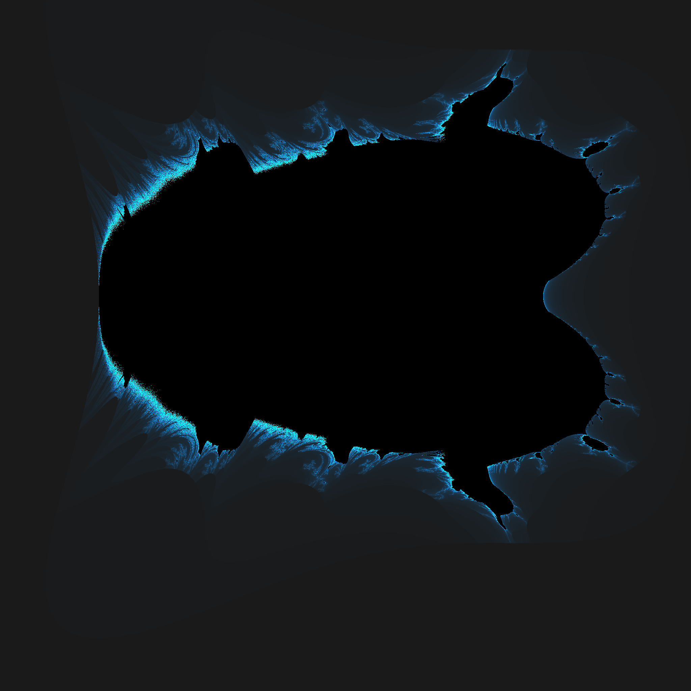

# Feilbrot

> Feil
> (adjective) neat and cosy

> Feil (Norwegian)
> Error

## What is it?

The mandelbrot set is a set composed of points in the complex plane where the repeated function f(z+1) = z^2 + C does to diverge when z starts at 0. 

Normally when implementing this, some people will end up writing their own datatype for complex numbers, with both a real and an imaginary component

When squaring a complex number (ex: (A + Bi)^2), you're supposed to end up with: A^2 + 2ABi - B^2. However if it's been many years since you've taken an algebra class, you may forget to double the middle part, which results in a chicken:



While this was fixed, the question came up: what other shapes could be created if I "mess up" the mandelbrot set, leading to this experimental repo.


## CLI Usage

```
Feilbrot

Usage:
  Feilbrot [options]

Options:
  --img-width                           [default: 256]
  --img-height                         [default: 256]
  --iterations <iterations>                        [default: 500]
  --brotname <Chicken|Circle|Mandlebrot|MantaRay>  [default: Chicken]
  --colorname <GrayCyan|Invert|Sin>                [default: GrayCyan]
  --outputfile <outputfile>                        [default: test.png]
  --version                                        Show version information
  -?, -h, --help                                   Show help and usage information
```

Example (rendering a decent sized invert color mandelbrot):

```
Feilbrot --image-width 2048 --image-height 2048 --iterations 1000 --brotname Mandelbrot --colorname Invert
```
